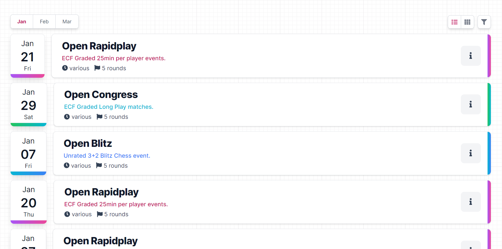

<p align="center">
  
  <h1 align="center">React Calendar</h1>
  <h3 align="center">with Tailwind CSS</h3>
</p>

[](https://github.com/matt-d-webb/react-calendar)

<p align="center">
  
</p>

## Uses

- React v17+
- TailwindCSS v3

```js
export default function App() {
  return (<Calendar data={[...]}></Calendar>)
}
```

| Name | Type | Required | Default | Description | 
|----|----|----|----|----|
| id | string | required | null | unique identifier |
| name | string | optional | null | overrides the 'EventType' name |
| description | string | optional | overrides the 'EventType' name |
| rounds | string | optional | unique identifier |
| times | string | optional | unique identifier |
| startDate | string | required | unique identifier |
| endDate | string | optional | unique identifier |
| maxEntries | string | optional | unique identifier |
| entryCount | string | optional | unique identifier |
| complete | string | required | unique identifier |
| cancellelled | string | required | unique identifier |
| isLive | string | required | unique identifier |
| active | string | required | unique identifier |
| type | string | required | unique identifier |
| color | string | required | unique identifier |
| textColor | string | required | unique identifier |
| url | string | required | unique identifier |
| isFull | string | required | unique identifier |

```ts
interface Event {
  id: string,
  name: string | null,
  description: string | null,
  rounds: number | null,
  time: string | null,
  startDate: string,
  maxEntries: number,
  entryCount: number | null,
  complete: boolean,
  cancelled: boolean,
  isLive: boolean,
  active: string,
  type: EventType, // <-- inherts `EventType` props
  color: string | null,
  textColor: string | null,
  url: string,
  isFull: boolean
}
// Defaults - helpful for repeating types which still need unqiue values i.e date, capacity
interface EventType {
  id: string,
  name: string,
  description: string,
  url: string,
  color: string,
  textColor: string,
  time: string | null,
  maxEntries: number,
  timeControl: string,
  eventType: string,
  defaultPrice: string,
  canRegister: boolean
}
```


