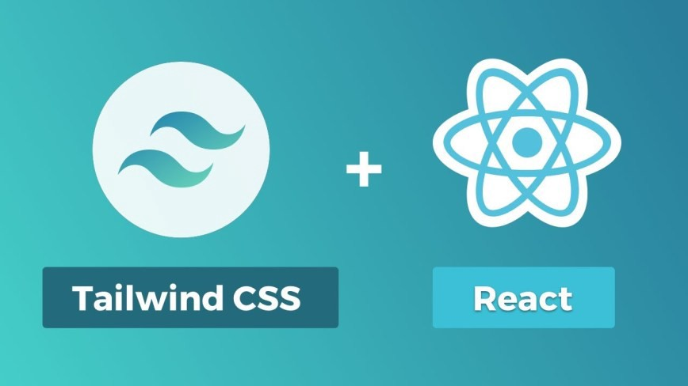

<p align="center">
  
  <h1 align="center">React Calendar</h1>
  <h3 align="center">with Tailwind CSS</h3>
</p>

[](https://github.com/matt-d-webb/react-calendar)

<p align="center">
  
</p>

## Uses

- React v17+
- TailwindCSS v3

```ts

export default function App() {

  const { events, loading, error } = useEvents(); // example: implement your own hook! 

  return (
      <Calendar data={events} isLoading={loading} isError={error} />
  )
}
```

## Event Props

| Name         | Type         | Required | Default | Description                                                 | 
|----          |----          |----      |----     |----                                                         |
| id           | `string`     | required | null    | unique identifier                                           |
| name         | `string`     | required | null    | heading name for the event  (max 100 char)                  |
| description  | `string`     | required | ""      | details for the event (max 500 char)                        |
| startDate    | `Date`       | required | today() | when the event takes place                                  |
| rounds       | `number`     | optional | 0       | events can have "rounds" like in a competition              |
| time         | `string`     | optional | null    | when the event starts, allows for "arrival time" type input |
| endDate      | `Date`       | optional | null    | when the event finishes                                     |
| maxEntries   | `number`     | optional | null    | maximum entries into the event                              |
| entryCount   | `number`     | optional | null    | current entries associated to event instance                | 
| complete     | `boolean`    | optional | false   | when had finsihed                                           |
| cancellelled | `boolean`    | optional | false   | event no longer taking place                                |
| isLive       | `boolean`    | optional | false   | event is in progress (streaming)                            |
| color        | `string`     | optional | teal    | highlight color                                             |
| textColor    | `string`     | optional | teal    | font colour                                                 |
| url          | `string`     | optional | null    | redirect url for a landing page or sign up                  |
| isFull       | `boolean`    | optional | false   | no more entries to this event allowed                       |


